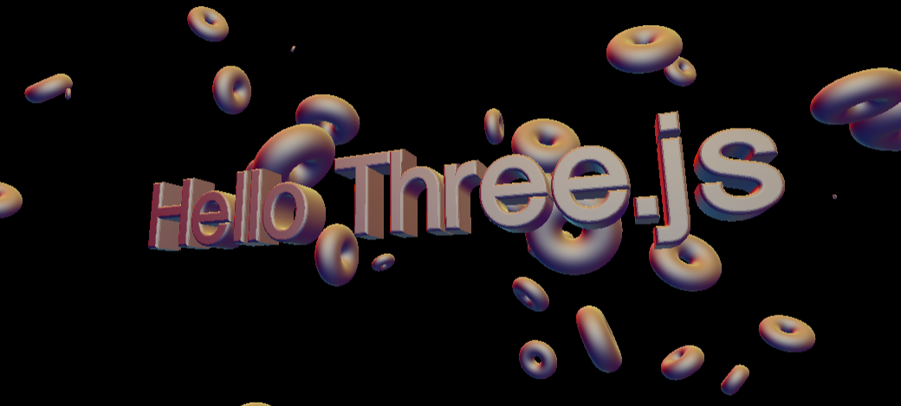

# 3D Text and Shape

   

- Link: https://webgl-3d-text-p9hqz1c8n-liamok19.vercel.app/

## Github author details
1. Liam O'Kane
    1. Github: https://github.com/liamok19
    2. Email: liamokane19@gmail.com
    3. Portfolio: https://liamok19.github.io/liamokane_updated_portfolio/

## Table of contents
- [Description](#description)

## Description
# What is the app for?
Going live with three.js. Playing around with Geometry, materials, position, rotation, scale and all the ingredients to merge the 3D production process with Web Development. 